# Arquitetura de Integração

#### Termos a serem destacados
Arquitetura Empresarial: O conceito de arquitetura empresarial é junção do tecnolgia com negócio, essa junção é amplamente 
discutida no TOGAF. O togaf (Open Group Architecture Framework) é um framework que auxilia na criação de uma arquitetura
corporativa de alto nível para o desenvolvimento. Além disso, TOGAF ajuda a organizar o processo de desenvolvimento por 
meio de uma abordagem sistemática que visa reduzir erros, manter cronogramas, manter o orçamento e alinhar a TI com as 
unidades de negócios para produzir resultados de qualidade.

#### Temas que iremos abordar

* Conceitos de serviços e microservices;
* Microservices patterns;
* Arquitetura Monolíticas, Microservices, Services Mesh x API;
* Transação Distribuída e Coordenada;
* API e APIGEE;
* Message Broker (EIP / Apache Kafka);
* NoSQl - MongoDB;

## O que é um serviço? 

Atualmente se formos observar um serviço dependendo do angulo que tu observa, poderá ter várias interpretações:

* No dicionário: uma tarefa repetitiva de negócio (ex. Consulta de crédito, abertura de conta). Toda arquitetura 
necessita de um negócio para ser criada, não se deve investir em uma arquitetura sem um proposito de negócio, pois 
se pensarmos a longo prazo estamos consumindo recursos da empresa e isso poderá causar sérios prejuízos.

* Em uma arquitetura orientada a serviços (SOA) : É um estilo de arquitetura de TI que suporta orientação a serviços.

* Orientação em serviço: uma maneira de integrar o negócio como serviços interligados e os resultados que eles trazem.
Sempre pensar na empresa realizando algum serviço, como a empresa trabalha, como as suas atividades auxilia seus 
clientes. Dentro da empresa podemos pensar em quais atividades qual área está executando ou seja é o dia a dia.

* Aplicação composta: um conjunto de serviços relacionados e interligados que suportam um produto de negócio 
construído em SOA e para existir depende de pequenos serviços.

Além dos exemplos anteriores dos exemplos anteriores podemos observar que um serviço pode encapsular regras de negócio e 
lógica, como:

* Um serviço pode encapsular a tarefa que é desempenhada por uma task individual de um conjunto de etapas. Que é um 
serviço simples e unitário, como por exemplo: envio de e-mail, emissão de nota fiscal.
Uma observação a ser realizada nesse ponto, voltado para angulo de microservices, é que nem toda task necessariamente é 
um microservice. Pois se criarmos um microservice para cada um, podemos chegar a número muito grande de microservices e 
a governança do mesmo a longo prazo pode ser bem complexo.

* Um serviço pode encapsular um sub-processo, que é composto por um conjunto de "tasks". Exemplo: o pagamento com cartão 
de crédito, pode estar contido em processo de venda, que pode estar contido em um processo de marketplace. Não é errado 
agrupar um conjunto de tasks para determinar um serviço.

* Um serviço pode encapsular o processo como um todo;
Exemplo: Quero realizar o serviço como todo, realizar uma venda, ou seja, se o cliente precisa ser cadastrado ou cartão 
de crédito do mesmo precisa ser cadastrado, não preciso saber. Somente chamo o serviço de venda e o mesmo deve ter 
responsabilidade de realizar os sub-serviços.

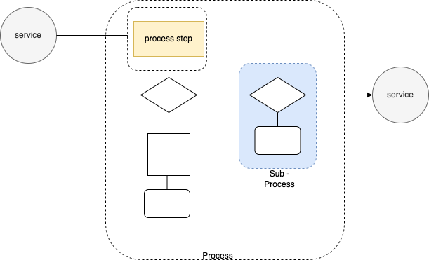

Os serviços tem que ser stateless. Mas o que seria uma aplicação Stateless?
Um serviço,processo ou até mesmo uma aplicação stateless são recursos isolados. Nenhuma referência ou informação sobre 
transações antigas são armazenadas, e cada uma delas é feita do zero. 

##Tipos de integrações de serviços

#### ESB - Enterprise Service Bus
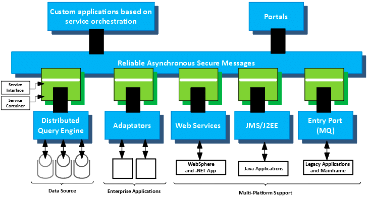

O Enterprise Service Bus (ESB) se refere à arquitetura de construção de software tipicamente implementado em tecnologias 
encontradas na categoria de produtos de infra-estrutura de middleware, ou pode ser conhecida também como arquitetura de 
barramento. Pois como vemos na imagem acima, temos um barramento executando toda a comunicação entre os serviços.

Caracteristicas do EBS:
* Converte - protocolos de transporte entre requisições e serviços;
* Transforma - formatos de mensagens entre requisições e serviços;
* Roteia - mensagens entre serviços;
* Distribui - eventos de negócios de/para fontes (publish/subscribe);

Pontos importantes:
* Microservices não é a nova versão do SOA (Iremos falar mais abaixo sobre os dois pontos), pelo contrário microservices 
são a evolução do SOA (SOA Next Generation).

Para entendermos o funcionamento do EBS:
* Se um serviço qualquer apresenta certa lentidão é necessário, escalonar todo o server pois o processo e suas task 
estão juntos (Venda que tem contida dentro de si, pagamento, baixa em estoque e demais outras tasks), com isso tinhamos 
uma perda grande de máquina, pois escalonávamos apenas por causa de uma task:
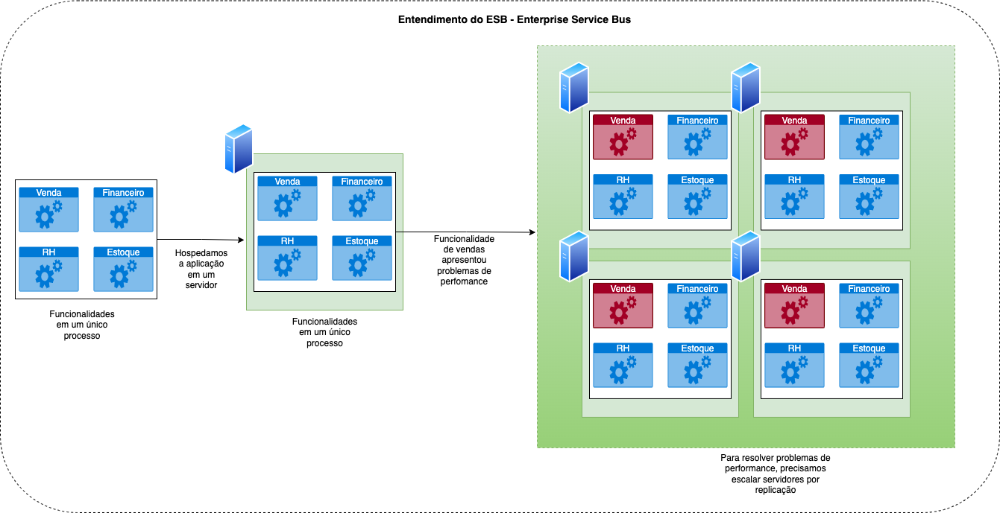

Um detalhe importante que podemos usar como exemplo, se loja desse sistema resolvesse vender mundialmente o seu sistema,
já imaginou quantos servidores precisariamos para manter esse sistema? E quanto gastariamos para manter esses servidores?

#### Microservices

* Microservices são um novo estilo arquitetural que propõe uma abordagem de desenvolvimento de sistemas compostos por um
 conjunto de pequenos serviços.
Dado o exemplo anterior, nesse novo estilo arquitetural, se o serviço de venda apresentasse lentidão, bastariamos 
escalonar ele e resolveriamos o nosso problema, escalonando somente ele em vários servidores. Quando a lentidão fosse 
resolvido basta desligar os servidores.

* Microservices devem ser grande o suficiente para ter uma funcionalidade bem definida, e pequeno o suficiente para ser 
independente. Um microservice tem que possuir uma alta coesão e baixo acoplamento, ou seja, o mesmo precisa ter um 
código para indicar a sua existência para facilitar sua manutenção a longo prazo e não pode haver dependencia de algum 
outro microservice para que o mesmo funcione. Pois quando precisar escalar esse microservice, precisará escalar também o 
seu dependente.

Com os conceitos de microservices sugiu também o DevOps, não vou adentrar nele, mas posteriormente devo escrever mais 
sobre o mesmo. Resumindo DevOps são as alterações no software sem downtime, sem precisar reiniciar os servidores ou 
até mesmo parar a aplicação que está em produção.

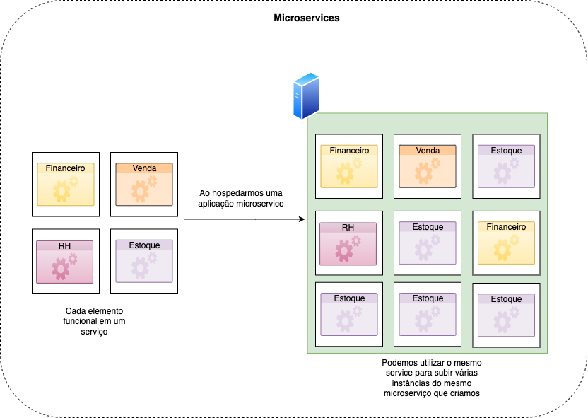

##### Caracteristicas do Microservice

* Componentizado por serviços;
* Organizado em torno de Capacidade de serviços de negócio;
* São produtos e não projetos;
* Pontos de conectividade mais inteligentes (Api, Mensageria);
* Governança descentralizada;
* Gestão de dados descentralizados, se não for bem gerenciando pode ser tornar um problema a longo prazo
* automação da infraestrutura via DevOps Skills;

Construção de um microservice é bem diferente rodar um microservice, pois quando enviamos o mesmo para produção, temos 
de nos preocupar com os seguintes pontos :
* Segurança;
* Monitoração e analytics - para sabermos como o microservice está se comportando e quem o está acessando;
* Documentação para possívelmente reaproveitarmos o microservice no futuro;

Pontos que precisamos de atenção com os microservices:

* Serviços poliglotas, requer desenvolvedores poliglotas, equipes multi linguagens para o desenvolvimento dos 
microservices na linguagem que for mais adequada para os problemas enfrentado. Um time multi linguagem tem custo 
elevado para se manter, então ao aderir uma tecnologia tenha em mente que futuramente o microservice precisa ser evoluido.

* Leva-se muito tempo para chegar lá, ou seja, não basta simplesmente criar um microservice em sua linguagem favorita e 
postar que sabe microservices. Pois quando se trabalha com microservices tem várias anunciancias para serem observadas,
desde o padrão que será utilizado até seu monitoramento para evolução.

* Cultura, não basta apenas conhecer o microservice, temos que saber se realmente temos um serviço validado como 
demonstrado anteriormente para a criação do mesmo.

* Testes são completos e complexos, precisamos ter testes que fazem sentido e que realmente teste nosso microservice, pois 
se o mesmo precisar de uma refatoração em alguma funcionalidade, basta executar o teste para verificar se o comportamento 
não foi alterado. Atualmente temos os seguintes testes : unitário, integração, funcional, regressão, stress, contrato. 
Cabe ao dev ou arquiteto validar quais são os testes que mais se encaixam no microservice que está sendo desenvolvido.

* Replicação de dados e Regras de negócio: deve se tomar cuidado com replicação de regras de negócio, se em algum 
momento essa regra for alterada precisaremos alterar em todos os pontos que a mesma está replicada. O ideal nesse seria 
um microservice possuir a regra de negócio exposta em forma de api ou outro tipo de comunicação para que todos os 
dependentes consigam utilizar. 
A replicação dos dados o grande desafio é manter todos as bases de dados integras sem causar deadlock no banco.

* Transações :  em uma arquitetura de microservices um grande problema é comunicação entre eles, precisamos trabalhar 
com uma resilência bem alta para que os dados trafegados não sejam perdidos, caso algum microservice esteja indisponível.

* Gestão de configuração e versionamento: na gestão de configuração estamos falando de load balance, autoscale, proxy 
reverso. Para versionamento são as ferramentas para versionar o código e disponibilização de uma versão especifica para 
um grupo de usuários para possíveis testes.

* Log das aplicações (tracing / tracking): como sincronizar os logs para que possa encontrar algum erro entre vários 
microservices, ou até mesmo rastrear uma mensagem que trafegou com todos os microservices. Atualmente temos algumas 
ferramentas que podem nos ajudar como jaeger, elk, entre outras.

### Microservices - Pattern de desenvolvimento

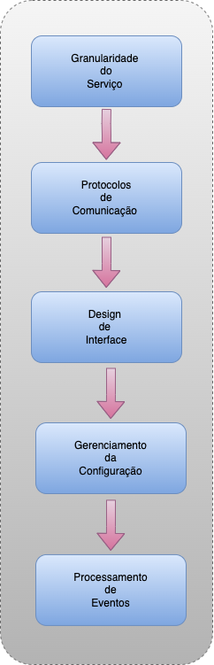

* Granularidade do serviço: qual é o nível certo de responsabilidade que o serviço deve ter? Lembrando que o mesmo pode 
ser : uma task, um sub-processo ou um processo.
* Protocolos de comunicação: Como o cliente e serviço se comunicam? Exemplo: rpc, rest, stream, http, sockets.
* Design de interface : como você vai expor seus endpoints para os clientes acessarem. Entra um pouco no conceito de 
produto, o microservice pode ser uma API.
* Gerenciamento da configuração : Como seus serviços gerenciam suas configurações, de forma que o código e a 
configuração sejam entidades independentes.
* Procesamento de eventos: como usar eventos para comunicar mudança de estado e dados entre os microservices. Não focar
 somente em request/response, podemos utilizar também pub/sub.

### Microservices - Routing Pattern

Esse é padrão muito simples de ser implementado, onde o primeiro microservice fica responsável por receber requests em uma 
URL única e envia a request para o próximo microservice que possui o mapeamento físico de onde os microservices estão hospedados.
É possível fazer essa arquitetura de um modo bem simples na AWS, com ECS e Load Balance com os microservices.

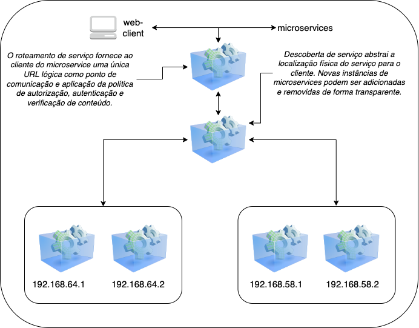

#### Microservices - Resiliency Pattern ou Resiliência Pattern

O pattern de resiliência tem como objetivo garantir que sistema posso estar disponível sempre que possível com a implentação 
de alguns conceitos:

Balanceador de carga: balancear as chamadas através de cache locais das instâncias do microservice ou para o microservices 
que estão recebendo menos carga.

Circuit breaker: garante que um cliente não chame repetidamente um microservice que está com falha. Em vez disso, o circuit 
breaker "falha rápido" para proteger o cliente, evitando de sobrecarregar o microservice que já estava apresentando falha e 
lhe ajudando a recuperar.

Fallback: Quando um microservice falha, existe um caminho alternativo que o cliente por tomar para recuperar 
dados ou tomar uma ação.

Bulkhead: Segredas em pool de threads diferentes as chamadas realizadas para microservices diferente.

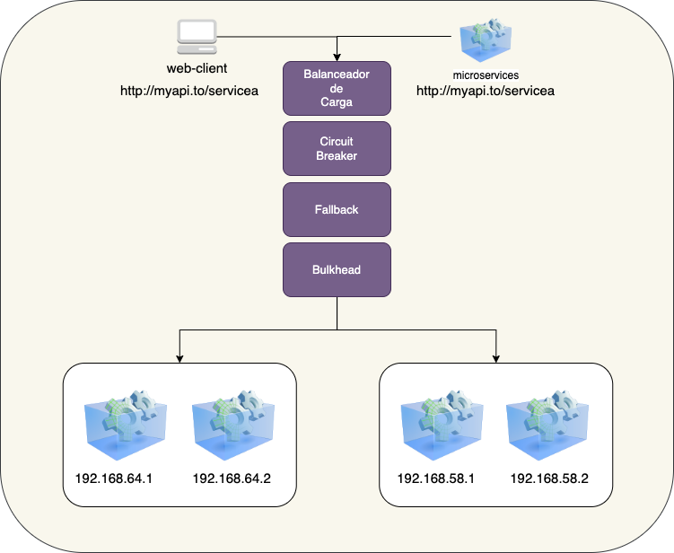

#### Microservices - Resiliency Pattern - Balanceador de carga

A ideia desse pattern é que toda a comunicação seja realizada entre os microservices passando por um load balancer que 
distribui as requests. Na mesma arquitetura algumas empresas utiliza os load balancers como master e master, em vez de 
master e slave como demonstrado na imagem abaixo. Outras utiliza o DNS como balanceador pois ter performance alta.
No desenho colocamos um banco de dados representando as rotas, mas na verdade a maioria das vezes é um arquivo de 
configuração das rotas.

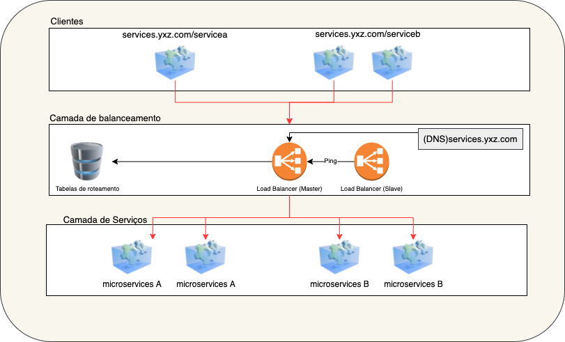

#### Microservices - Resiliency Pattern - Balanceador de Carga - Cloud

* Quando um cliente de serviço precisar chamar um microservice, ele verificará no cachê local os IPs da instância de 
serviço. O balanceamento de carga entre instâncias de serviço ocorrerá no serviço.

* Periodicamente o cache do lado do cliente será atualizado.

* Se o cliente encontrar um IP de serviço no cachê, ele será usado. Caso contrário vai para o service discovery.

* Os heartbeat ou health check atualizam constantemente os services discovery sobre sua saúde / disponibilidade. 

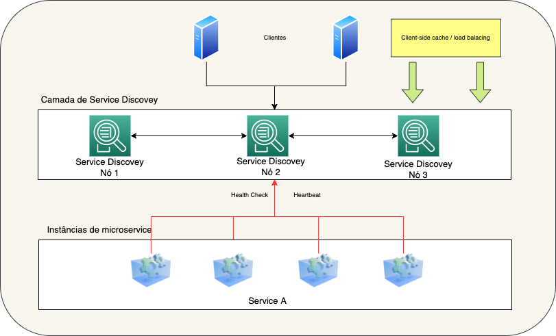

#### Microservices - Resiliency Pattern - Bulkhead

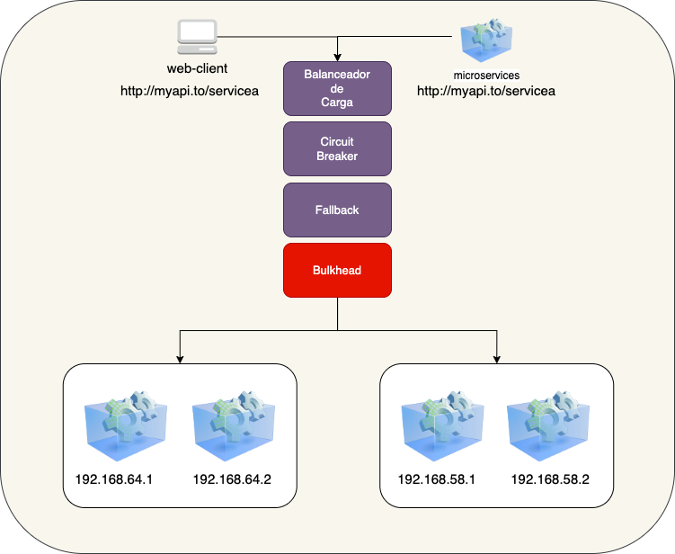

Abaixo, demonstramos um pouco do funcionamento do bulkhead com apenas um pool de threads para todo o sistema:

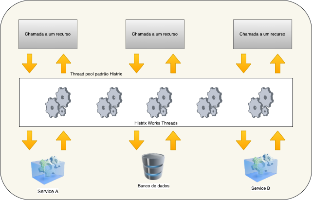

* Todas as chamadas do recurso remoto estão em um único pool de threads compartilhados.
* Um único serviço com desempenho lento pode saturar o pool de threads, além de causar esgotamento compartilhado.

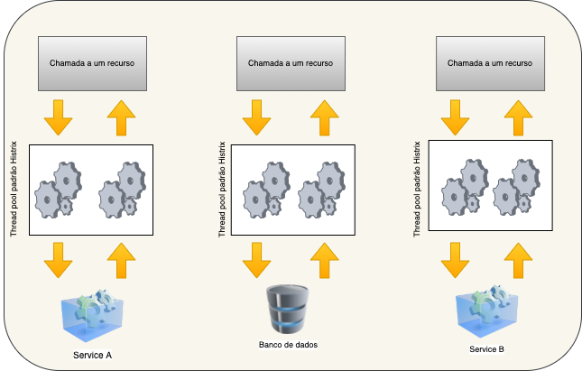

* Cada chamada de recurso remoto é colocada em seu próprio pool de threads. Cada pool de threads tem um número máximo de 
threads que pode ser usado para processar uma solicitação.
* Um serviço de baixo desempenho terá impacto em outra chamadas de serviço no mesmo pool de threads, limitando assim o 
dano que a chamada pode causar.
* Para spring boot atualmente tem se utilizado o Resilience4j que surgiu após uma inspiração do Hystrix da Netflix 
atualmente descontinuado, o mesmo ainda possui de circuit breaker, ratelimiter, retry, cachê, time limiter e o bulkhead 
apresentado nessa seção.

#### Microservices - Security Pattern

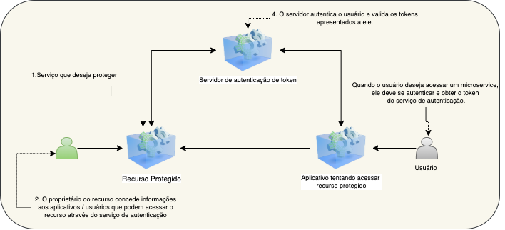

Hoje o padrão está mais evoluído mas viemos lhe apresentar de maneira mais simples para que possa entender mais sobre 
esse conceito. Nele temos dois conceitos simples que são :
* Autenticação: validação de suas permissões para acessar recursos restritos.
* Autorização: você possui acesso aos recursos restritos baseado em suas permissões.

